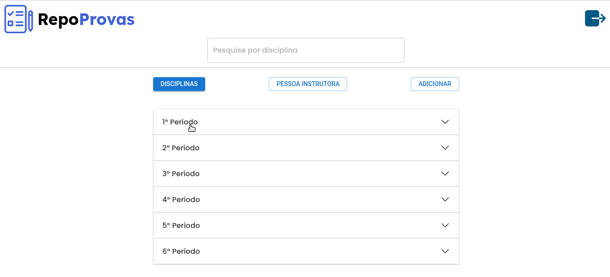
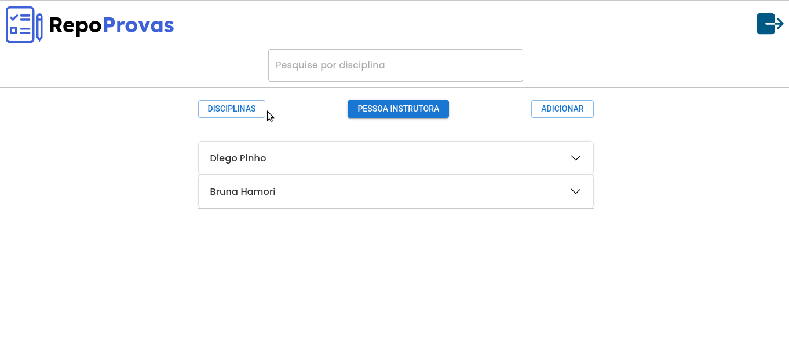
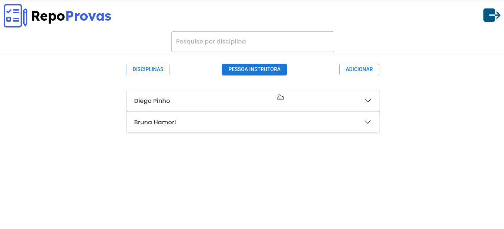

# projeto20-repoProvas

Project developed using TypeScript for tests management

<p align="center">
  
</p>
<h1 align="center">
  RepoProvas
</h1>
<div align="center">

  <h3>Built With</h3>

  
  
  <!-- Badges source: https://dev.to/envoy_/150-badges-for-github-pnk -->
</div>

<br/>

## Links

[Repositorio Back-end](https://github.com/ThVinicius/repoProvas_backEnd)

[Deploy Front-end](http://repo-provas-front-end-lake.vercel.app/)

[Deploy Back-end](https://th-repoprovas.herokuapp.com/)

</br>

## Rota /home

Nessa rota é possivel:

- Visualizar as provas por disciplina
  - provas agrupadas por tipo de prova;
  - tipos de provas agrupadas por disciplina;
  - disciplinas agrupadas por período;

<h1 align="center" >

</h1>

- Visualizar as provas por pessoa instrutora
  - provas agrupadas por tipo de prova;
  - tipos de provas agrupadas por pessoa instrutora;

<h1 align="center" >

</h1>

- Adicionar novas provas

<h1 align="center" >

</h1>

#

## Variaveis de ambiente

Para rodar esse projeto será necessário criar um arquivo `.env` na pasta raiz do projeto e adicionar as sequintes variaveis:

- `REACT_APP_API_URL`
  - URL da API back-end (sem a barra no final)
    - Ex: http://localhost:4000

## Rodar localmente

Clone no projeto

```bash
  git clone https://github.com/ThVinicius/repoProvas_frontEnd.git
```

Vá para o diretório da pasta

```bash
  cd repoProvas_frontEnd
```

Instale as dependencias

```bash
  npm install
```

Inicie o projeto

```bash
  npm start
```
